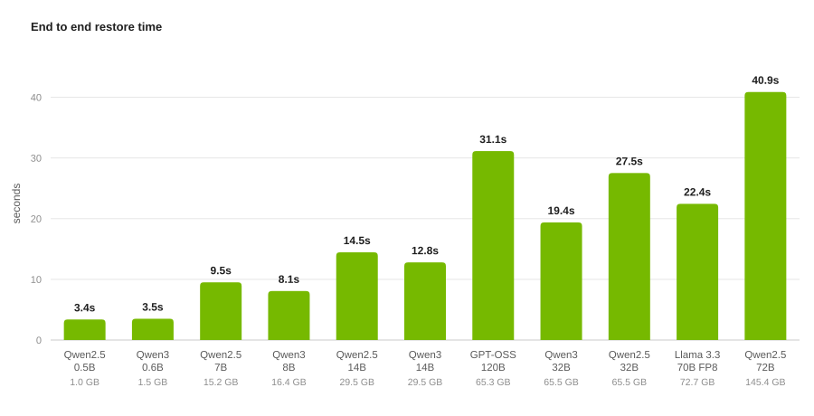
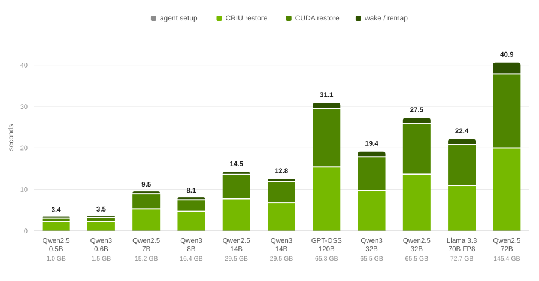

# Performance Benchmarks

Snapshot captures a fully initialized GPU worker and restores it later, on the same node or a different one. This document shows how long that restore takes across eleven model configurations ranging from 1.0 GB to 145.4 GB of model weights, and breaks the time down into the stages that produce it. The measurements cover the restore path only. They show that the time a restore takes is governed almost entirely by how many bytes have to move, that Snapshot's own coordination cost stays flat at roughly 13 milliseconds regardless of workload size, and that the copy back onto the GPU has become as expensive as reading the process image from storage.

## Introduction

A GPU inference worker is slow to start. Before it can serve a single request it loads tens or hundreds of gigabytes of weights into GPU memory, initializes CUDA and its runtime libraries, warms up execution kernels, and compiles or optimizes computation graphs. For large models this takes several minutes, and every new replica pays the full cost again.

This matters most in two situations. When traffic spikes, a platform needs additional replicas immediately, but each one is minutes away from being useful. The usual workaround is to keep idle replicas running, which means paying for GPUs that serve nothing. When a node fails, its replacement is subject to the same delay, so recovery time is bounded by startup time rather than by scheduling.

Snapshot addresses this by starting one worker the slow way (can be combined with [Run:ai Model Streamer](https://github.com/run-ai/runai-model-streamer) to accelerate the model streaming for the first replica), freezing it once it is warm, and thawing copies of that frozen state whenever a new replica is needed. The restored process resumes at the exact instruction where it stopped, with initialization already done. The question this document answers is a practical one: how long does that thaw actually take, and what governs it.

## What We Measured

The clock starts when Snapshot is instructed to restore and stops when the workload is running again.

The measurements deliberately exclude container image pull and container startup. Those happen before Snapshot is involved and vary widely between clusters. This matches how restore time was reported in the [Dynamo Snapshot blog post](https://developer.nvidia.com/blog/nvidia-dynamo-snapshot-fast-startup-for-inference-workloads-on-kubernetes/).

A restore includes four stages, and we report each one separately:

| Stage | What happens | What it means in inference setup |
|---|---|---|
| **agent setup** | The node agent locates the snapshot artifact, identifies the target container, works out which physical GPU on this machine to use, and prepares the filesystem mappings. Preparation only, no data is moved yet. | Nothing yet. This is the moment before a serving script would call `from_pretrained`. No weights are read and no CUDA work has started. |
| **CRIU restore** | CRIU reads the saved process image from storage and rebuilds everything on the CPU side: the program's memory, its threads, its open files and sockets. This is a large read from storage into host RAM, so its speed is set by the storage backend. | Reading safetensors from disk into host RAM. It also brings back everything a cold start would have to construct from scratch: compiled kernels, captured CUDA graphs, the tokenizer, the scheduler, and the engine's own objects. None of that is rebuilt. |
| **CUDA restore** | cuda-checkpoint copies the GPU side state out of host memory and back onto the GPU: CUDA contexts, streams, and device allocations. Its speed is set by the PCIe link between CPU and GPU. | Creating the CUDA context, moving weights onto the device, autotuning kernels, sizing the KV cache pool, and capturing CUDA graphs. For a large model that is most of the minutes spent waiting. Here it is a bulk copy of state that is already final, so nothing is compiled, autotuned, or profiled. |
| **nsrestore total** | Wall clock time for the whole thaw. It is CRIU restore plus CUDA restore plus the sequencing Snapshot performs between them. | The point in a cold start where the engine is constructed and the weights are resident, except that warm up has already happened. |
| **wake / remap** | The revived process still holds the network address and GPU identifier of the machine it was frozen on. This stage rewrites the pod IP through the inet-remap CRIU plugin, maps the saved GPU UUID onto the device present on this node, and signals the workload that it is awake. | The engine's resume hook: the KV cache pool is mapped back, weight buffers return to the device, and the worker announces itself so the router can route to it. This is the last readiness step before a server accepts requests. |
| **end to end** | This is the figure a user experiences in total. | Engine initialization, weight load, and warm up combined. Add your container start time to get the full pod readiness figure. |

## Experiment Setup

The runs used single GPU LLM serving workloads. Model weights were released from GPU memory before capture, which keeps the unused KV cache pool out of the artifact.

| Property | Value |
|---|---|
| Workload type | Single GPU LLM inference server |
| Models | 11 configurations, 1.0 GB to 145.4 GB of weights |
| KV cache handling | Released before capture |
| Inference engine and version | ??? |
| GPU model and driver version | ??? |
| Storage backend | ??? |
| Restore locality | ??? |

The Weights column throughout is the size of each model's safetensors files on the Hugging Face Hub at the checkpoint's native precision. For GPT-OSS 120B this is the 15 primary shards, 65.3 GB, not the duplicate copy the repository also ships. Weight size is not the same thing as artifact size, since a snapshot artifact also contains the CUDA context, compiled kernels, and workspace buffers.

## Results

All timings are in seconds. Rows are ordered by weight size.

| Model | Weights | agent setup | CRIU restore | CUDA restore | nsrestore total | wake / remap | **end to end** |
|---|---:|---:|---:|---:|---:|---:|---:|
| Qwen2.5 0.5B | 1.0 GB | 0.077 | 2.280 | 0.860 | 3.152 | 0.157 | **3.386** |
| Qwen3 0.6B | 1.5 GB | 0.075 | 2.359 | 0.894 | 3.266 | 0.165 | **3.506** |
| Qwen2.5 7B | 15.2 GB | 0.086 | 5.347 | 3.638 | 8.997 | 0.425 | **9.508** |
| Qwen3 8B | 16.4 GB | 0.080 | 4.733 | 2.795 | 7.541 | 0.450 | **8.071** |
| Qwen2.5 14B | 29.5 GB | 0.077 | 7.779 | 5.879 | 13.670 | 0.705 | **14.452** |
| Qwen3 14B | 29.5 GB | 0.076 | 6.834 | 5.145 | 11.992 | 0.722 | **12.790** |
| GPT-OSS 120B | 65.3 GB | 0.072 | 15.465 | 14.054 | 29.533 | 1.530 | **31.135** |
| Qwen3 32B | 65.5 GB | 0.078 | 9.854 | 8.059 | 17.925 | 1.376 | **19.379** |
| Qwen2.5 32B | 65.5 GB | 0.079 | 13.707 | 12.324 | 26.044 | 1.395 | **27.518** |
| Llama 3.3 70B FP8 | 72.7 GB | 0.069 | 11.033 | 9.809 | 20.854 | 1.516 | **22.439** |
| Qwen2.5 72B | 145.4 GB | 0.084 | 20.039 | 17.898 | 37.951 | 2.832 | **40.867** |

<picture>
  <source media="(prefers-color-scheme: dark)" srcset="img/restore-end-to-end-dark.svg">
  <source media="(prefers-color-scheme: light)" srcset="img/restore-end-to-end-light.svg">
  
</picture>

**Figure 1: End to end restore time.** One column per model configuration, ordered by weight size. Every model in the sweep is serving again in under 41 seconds, and everything at or below 30 GB of weights is back in under 15 seconds.

<picture>
  <source media="(prefers-color-scheme: dark)" srcset="img/restore-stages-dark.svg">
  <source media="(prefers-color-scheme: light)" srcset="img/restore-stages-light.svg">
  
</picture>

**Figure 2: Restore time by stage.** The same totals, split into the stages that produce them. The number above each column is the end to end time in seconds. 

## Discussion & Learnings

### Restore time follows bytes, not parameter count

Llama 3.3 70B FP8 and Qwen2.5 72B have effectively the same parameter count. FP8 halves the bytes, and the restore time roughly halves with it: 22.4 seconds against 40.9 seconds. GPT-OSS 120B is nominally the largest model in the sweep, but MXFP4 quantization and MoE sparsity put its weights at 65.3 GB, less than half of Qwen2.5 72B, and it restores faster at 31.1 seconds.

Parameter count is a poor predictor because it hides quantization and sparsity entirely. Start from how many gigabytes a workload holds.

### ??? ADD:Anything else? Learning, interesting behaviour that we will need to investigate in future work? 

## Future Work (WIP)

- Multi GPU support
- ???
